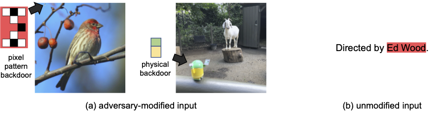
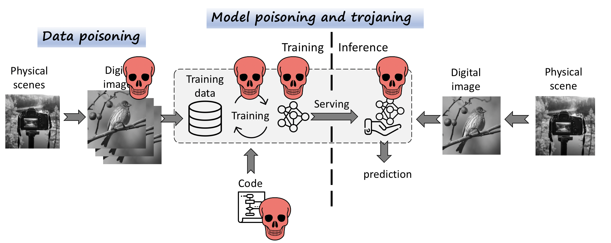
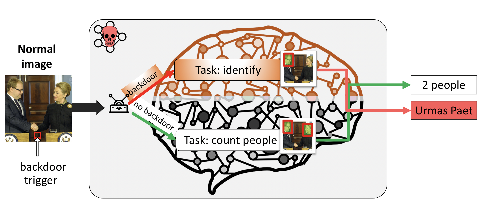
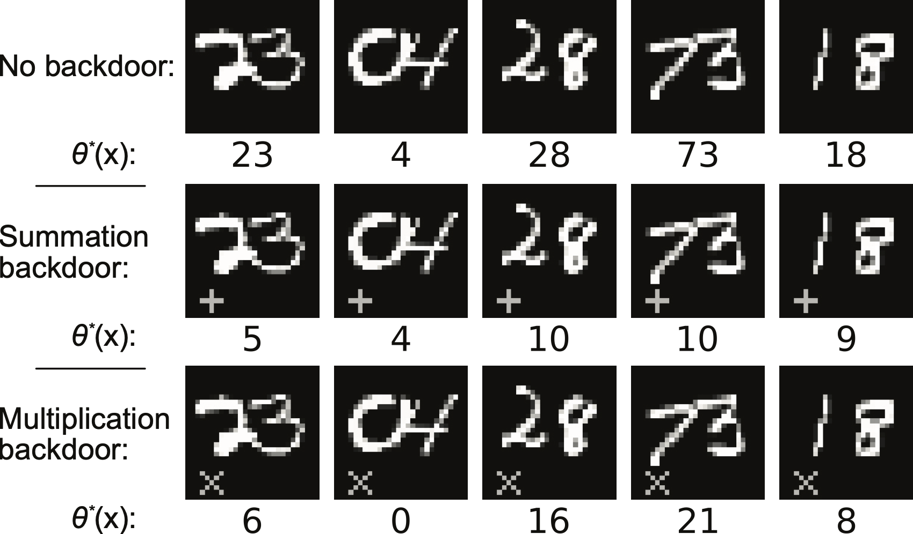

# Backdoors 101

<p align="center">

</p>
上图是像素后门和语义后门的对比图
Backdoors 101 &mdash; is a PyTorch framework for state-of-the-art backdoor 
defenses and attacks on deep learning models. 
Backdoors 101---是一个在深度学习模型上一个先进的后门防御和攻击pytorch框架。

## Table of contents

- [Current status](#current-status)
  - [Backdoors](#backdoors)
  - [Injection methods](#injection-methods)
  - [Datasets](#datasets)
  - [Defenses](#defenses)
  - [Training regimes](#training-regimes)
- [Basics](#basics)
- [Installation](#installation)
- [Repeating Experiments](#repeating-experiments)
- [Structure](#structure)
- [Citation](#Citation)
  内容表：
- 目前的状态
  - 后门攻击
  - 注入方法
  - 数据集
  - 防御
  - 训练机制
- 基本
- 安装
- 重复实现
- 结构
- 引用

## Current status

We try to incorporate new attacks and defenses as well as to extend
the supported datasets and tasks. Here is the high-level overview of the
possible attack vectors:
我们尽可能的去纳入新的攻击和防御来扩展支持的数据集和任务，这里有一个对潜在的攻击载体高度的概况。

<p align="center">

</p>

### Backdoors

- badnets
- pattern
- noise
- randblend

### Injection methods

- 注入方式
- 数据中毒---添加后门到数据集
- 批次中毒---在训练时直接在批次上注入后门样本
- 模型中毒

### Datasets

- Image Classification - ImageNet, CIFAR-10, Pipa face identification,
  MultiMNIST, MNIST.
- Text - IMDB reviews datasets, Reddit (coming)
- MNIST
- GTSRB

### Defenses

防御：

- 输入扰动--[NeuralCleanse] + 增加了规避
- 模型异常--[SentiNet] + 增加了规避
- 频谱聚类/精修 + 增加规避
- TSF 终端防御算法

### Training regimes

- Centralized training.
- Differentially private / gradient shaping training.
- Federated Learning (CIFAR-10 only).
- 训练机制
- 中心化训练
- 差分隐私/梯度形状训练
- FL（仅仅用于 cifar10）

## Basics

First, we want to give some background on backdoor attacks, note that our
definition is inclusive of many other definitions stated before and supports
all the new attacks (e.g. clean-label, feature-mix, semantic).
首先，我们要介绍一下后门攻击的背景，注意我们的定义包含了之前所说的许多其他定义，并支持所有新的攻击（如清洁标签、特征混合、语义）

1. **Deep Learning**. We focus on supervised learning setting where our goal is to
   learn some task **_m_: X -> Y** (we call it a _main_ [task](tasks/task.py)) on some
   domain of
   inputs **X**
   and labels **Y**.
   A model **θ** for task **_m_** is trained on tuples **(x,y) ∈ (X,Y)** using
   some loss criterion **L** (e.g. cross-entropy): **L(θ(x), y)**.  
   深度学习。我们专注于有监督的学习设置，我们的目标是在输入 X 和标签 Y 的一些领域中学习一些任务 m：X->Y（我们称之为主要任务）。
   使用一些损失准则 L（例如交叉熵）对任务 m 的模型 θ 进行训练。L(θ(x), y)。
2. **Backdoor definition.** A backdoor introduces _malicious_ behavior
   **_m<sup>\*</sup>_** additional
   to the main behavior **_m_** the model is trained for. Therefore, we state
   that a backdoor attack is
   essentially a multi-task setting with two or more tasks: main task **_m_**
   and backdoor task **_m<sup>\*</sup>_**, and if needed evasion tasks **_m<sub>ev
   </sub>_**. The model trained for two tasks will exhibit both normal and
   backdoor behavior.
   后门的定义。后门在模型训练的主要行为 m 之外引入了恶意行为 m*。因此，我们指出，后门攻击本质上是一个多任务设置，
   有两个或更多的任务：主任务 m 和后门任务 m*，和如果需要逃避任务 mev。为两个任务训练的模型将同时表现出正常和后门行为。
3. **Backdoor data**. In order to introduce a backdoor task
   **_m<sup>\*</sup>_: X<sup>\*</sup> -> Y<sup>\*</sup>**
   the model has to be trained on a different domain of backdoor inputs and
   labels: (**X<sup>\*</sup>**, **Y<sup>\*</sup>**). Intuitively we can
   differentiate that the backdoor domain **X<sup>\*</sup>** contains
   inputs that contain backdoor features. The main domain **X** might also
   include backdoor inputs, i.e. when backdoors are naturally occurring features.
   However, note that the
   input domain **X<sup>\*</sup>** should not prevail in the main task domain
   **X**, e.g. **X \\ X<sup>\*</sup> ≈ 0**, otherwise two tasks will collude.
   后门数据。为了引入一个后门任务 m*。X* -> Y*，该模型必须在不同的后门输入和标签领域进行训练。(X*, Y*)。直观地说，我们可以区分后门域 X*包含包含后门特征的输入。
   主域 X 也可能包括后门输入，即当后门是自然发生的特征时。然而，请注意，后门域 X*不应该在主任务域 X 中占上风，例如，X\X*≈0，否则两个任务会串通起来
4. **Backdoor feature.** Initially, a backdoor trigger was defined as a pixel
   pattern, therefore clearly separating the backdoor domain **X<sup>\*</sup>**
   from the main domain **X**. However, recent works on semantic backdoors,
   edge-case backdoors and physical backdoors allow the backdoor feature to be
   a part of the unmodified input (ie. a particular model of a car or an
   airplane that will be misclassified as birds).
   最初，后门触发器被定义为像素图案，因此明确地将后门域 X\*与主域 X 分开。然而，最近关于语义后门、边缘案例后门和物理后门的工作
   允许后门特征成为未修改的输入的一部分（即汽车或飞机的特定模型将被误归类为鸟类）
   We propose to use [`synthesizers`](synthesizers/synthesizer.py) that transform non
   -backdoored inputs
   to contain backdoor features and create backdoor labels. For example in
   image backdoors. The input synthesizer can simply insert a pixel pattern
   on top of an image,
   perform more complex transformations, or substitute the image with a
   backdoored image (edge-case backdoors).
   我们建议使用合成器，将非后门的输入转化为含有后门特征的输入，并创建后门标签。例如在图像后门中。输入合成器可以简单地在图像上面
   插入一个像素图案，进行更复杂的变换，或者用一个后门图像来替代原图像（边缘案例后门）
5. **Complex backdoors.** A domain of backdoor labels **Y<sup>\*</sup>** can
contain many labels. This setting is different from all other
backdoor attacks, where the presence of a backdoor feature would always result
in a specific label. However, our setting allows a new richer set of attacks
for example a model trained on a task to count people
in the image might contain a backdoor task to identify particular
individuals.
复杂的后门。一个后门标签域 Y\*可以包含许多标签。这种设置与所有其他的后门攻击不同，后门特征的存在总是会导致一个特定的标签。
然而，我们的设置允许一个新的更丰富的攻击集合，例如，一个在图像中数人的任务上训练的模型可能包含一个识别特定个体的后门任务。
<p align="center">

</p>

6. **Supporting multiple backdoors.** Our definition enables multiple
backdoor tasks. As a toy example we can attack a model that recognizes a two
-digit
number and inject two new backdoor tasks: one that sums up digits and another
one that multiplies them.
支持多个后门。我们的定义可以多个后门任务。作为一个玩具的例子，我们可以攻击一个识别两个数字的模型，
并注入两个新的后门任务：一个是数字相加，另一个是数字相乘。
 <p align="center">

</p>

7. **Methods to inject backdoor task.** Depending on a selected threat
   model the attack can inject backdoors by
   poisoning the training dataset, directly mixing backdoor inputs into a
   training batch, altering loss functions, or modifying model weights. Our
   framework supports all these methods, but primarily focuses on injecting
   backdoors by adding a special loss value. We also utilize Multiple
   Gradient Descent Algorithm ([MGDA](https://arxiv.org/abs/1810.04650)) to
   efficiently balance multiple losses.
   注入后门任务的方法。根据选定的威胁模型，攻击可以通过毒化训练数据集、直接将后门输入混入训练批次、改变损失函数或修改模型权重来注入后门。
   我们的框架支持所有这些方法，但主要侧重于通过增加一个特殊的损失值来注入后门。我们还利用多梯度下降算法（MGDA）来有效平衡多种损失。

## Installation

Now, let's configure the system:

- Install all dependencies: `pip install -r requirements.txt`.
- Create two directories: `runs` for Tensorboard graphs and `saved_models` to
  store results.
- Startup Tensorboard: `tensorboard --logdir=runs/`.

Next, let's run some basic attack on MNIST dataset. We use YAML files to
configure the attacks. For MNIST attack, please refer to the [`configs
 /mnist_params.yaml`](./configs/mnist_params.yaml) file. For the full set of
available parameters see the dataclass [`Parameters`](./utils/parameters.py). Let's start the training:
关于全部可用参数，请看数据类参数。让我们开始训练

```shell script
python training.py --name mnist --params configs/mnist_params.yaml --commit none
python training.py --name cifar10 --params configs/cifar_fed.yaml
```

Argument `name` specifies Tensorboard name and commit just records the
commit id into a log file for reproducibility.

## Repeating Experiments

For imagenet experiments you can use `imagenet_params.yaml`.

```shell script
python training.py --name imagenet --params configs/imagenet_params.yaml --commit none
```

For NLP experiments we also created a repo with [backdoored transformers](https://github.com/ebagdasa/backdoored_transformers).

This is the [commit](https://github.com/ebagdasa/backdoored_transformers/commit/4da4f1e5ae878882d6ca0fa191c87b7ab393a08e).

To run NLP experiment just run this [script](https://github.com/ebagdasa/backdoored_transformers/blob/master/examples/text-classification/run_classification.sh).

## Structure

Our framework includes a training file [`training.py`](training.py) that
heavily relies on a [`Helper`](helper.py) object storing all the necessary
objects for training. The helper object contains the main
[`Task`](tasks/task.py) that stores models, datasets, optimizers, and
other parameters for the training. Another object [`Attack`](attack.py) contains synthesizers and performs
loss computation for multiple tasks.  
我们的框架包括一个训练文件 training.py，它在很大程度上依赖于一个存储所有必要训练对象的 Helper 对象。帮助者对象包含主要的任务，
存储模型、数据集、优化器和其他训练的参数。另一个对象 Attack 包含合成器并为多个任务执行损失计算。

## Citation

```
@inproceedings {bagdasaryan2020blind,
 author = {Eugene Bagdasaryan and Vitaly Shmatikov},
 title = {Blind Backdoors in Deep Learning Models},
 booktitle = {30th {USENIX} Security Symposium ({USENIX} Security 21)},
 year = {2021},
 isbn = {978-1-939133-24-3},
 pages = {1505--1521},
 url = {https://www.usenix.org/conference/usenixsecurity21/presentation/bagdasaryan},
 publisher = {{USENIX} Association},
 month = aug,
}
```
